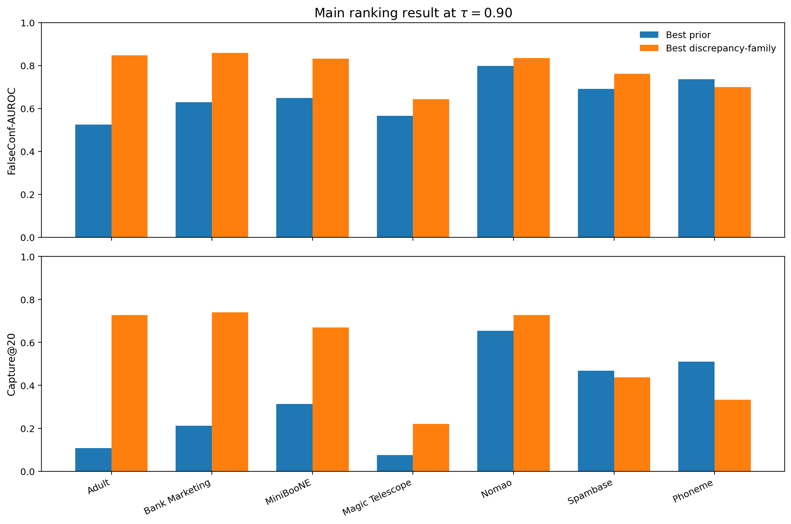
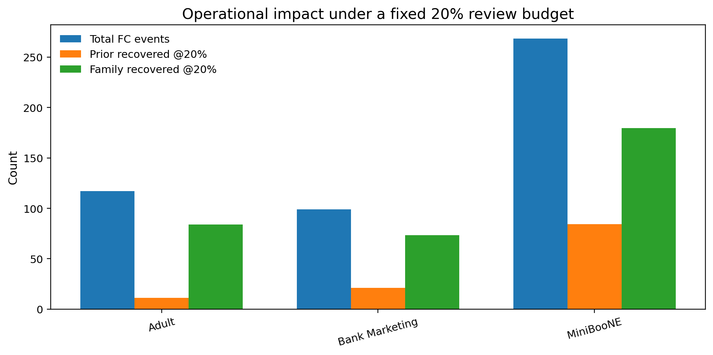
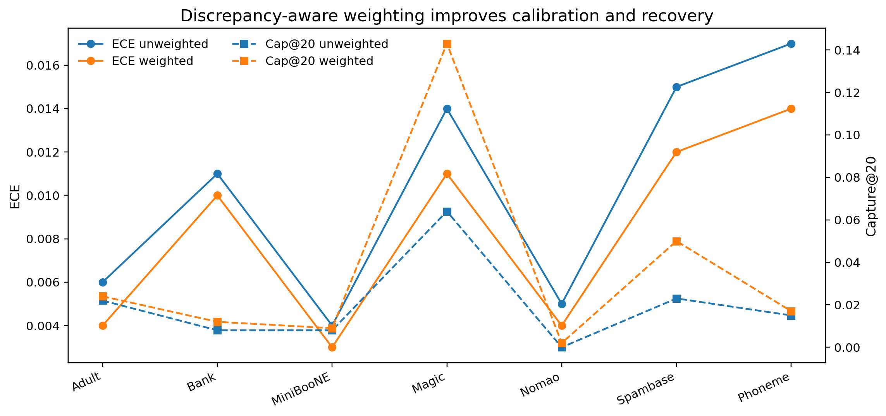
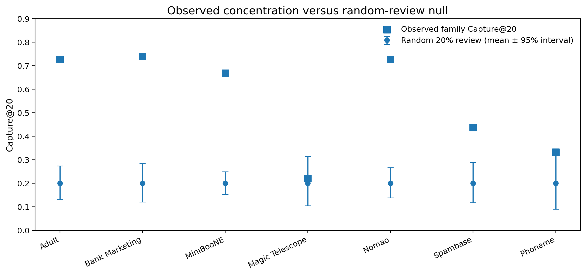
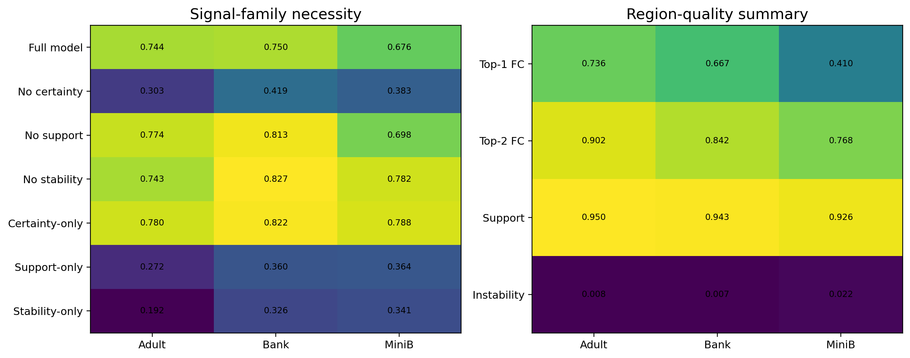

# FALCON-Discover: Artifact


This repository is an **anonymous review artifact** for the paper:

> **FALCON-Discover: Discovering Concentrated False-Confidence Regions for Calibration**

FALCON-Discover studies **false-confidence concentration**: whether dangerous high-confidence errors occupy a compact and discoverable slice of prediction space, rather than being diffusely spread across the test set. The artifact is organized for **double-blind review**: it exposes the claim-bearing structure, precomputed result tables, polished figures, and a compact shareable code path, while withholding the full production orchestration and machine-specific training stack.

---

## What this artifact contains

| Folder | Contents | Why it is included |
|---|---|---|
| `src/falcon_review_artifact/` | compact reference implementation of core FALCON objects | lets reviewers inspect the reusable discrepancy-state logic |
| `data/precomputed/` | anonymous CSVs for headline tables and appendix checks | reproduces reported results without rerunning the full private grid |
| `scripts/` | small scripts to recreate tables, figures, and one toy end-to-end example | gives reviewers a fast smoke-test path |
| `tools/` | supplementary validation runner adapted from the paper workflow | exposes the reproducibility interface for extended checks |
| `assets/figures/` | polished visual summaries and recreated figures | makes the artifact professionally inspectable |
| `paper_snippets/` | equations and algorithm snippets mapped to the paper | links code to notation and claims |
| `docs/` | GitHub Pages-style landing page | provides a reviewer-friendly front page |

---

## Headline result

| Dataset | Prior AUROC | Family AUROC | Prior Cap@20 | Family Cap@20 | ΔAUROC | ΔCap@20 |
|---|---:|---:|---:|---:|---:|---:|
| Adult | 0.525 | **0.847** | 0.108 | **0.728** | +0.322 | +0.621 |
| Bank Marketing | 0.629 | **0.859** | 0.212 | **0.740** | +0.230 | +0.528 |
| MiniBooNE | 0.649 | **0.832** | 0.314 | **0.669** | +0.182 | +0.355 |
| Magic Telescope | 0.566 | **0.643** | 0.075 | **0.221** | +0.077 | +0.145 |
| Nomao | 0.798 | **0.835** | 0.654 | **0.728** | +0.038 | +0.074 |
| Spambase | 0.691 | **0.762** | 0.468 | **0.437** | +0.071 | -0.031 |
| Phoneme | 0.736 | **0.700** | 0.511 | **0.333** | -0.036 | -0.178 |

Across the strongest regimes, the discrepancy family surfaces a **large majority of dangerous false-confidence mass under the same review budget**, while the strongest family member varies by regime. This is why the paper makes a **family-level discovery claim**, not a single-score dominance claim.

<p align="center">
  
</p>

---

## Operational impact at a glance

For the three strongest datasets, the family recovers far more dangerous confident errors under a fixed 20% review budget:

| Dataset | FC events | Prior recovered @20% | Family recovered @20% |
|---|---:|---:|---:|
| Adult | 117.0 | 11.25 | **84.00** |
| Bank Marketing | 99.0 | 21.00 | **73.25** |
| MiniBooNE | 268.5 | 84.25 | **179.50** |

<p align="center">
  
</p>

---

## Why this artifact is review-safe

This repository is intentionally **not** the full private training stack. It is an anonymous, shareable review artifact that includes:

- the central definitions used in the paper;
- a compact reusable code path for the discrepancy state and certificate-style metrics;
- table-level reproduction scripts aligned with the appendix reproduction map;
- selected precomputed outputs and polished reviewer-facing figures;
- the supplementary validation runner interface for additional empirical checks.

It does **not** include:

- private orchestration code,
- machine-specific paths or logs,
- identifying repository history,
- the full production experiment manager,
- author metadata.

---

## Reproduction map

The paper’s appendix maps each empirical object to a dedicated reproduction script. This artifact mirrors that structure:

| Paper object | Script in this artifact |
|---|---|
| Table 1 main multi-dataset result | `scripts/make_main_results.py` |
| Table 2 operational impact | `scripts/make_operational_impact.py` |
| Table 3 discrepancy-family ablation | `scripts/make_family_ablation.py` |
| Tables 4–5 extended validation and consequences | `scripts/make_extended_validation.py`, `scripts/make_consequences_baselines.py` |
| Table 14 uncertainty intervals | `scripts/make_uncertainty_table.py` |
| Table 15 random-review null comparison | `scripts/make_null_concentration.py` |
| Appendix figures | `scripts/make_figures.py` |

---

## Quick start

```bash
python -m venv .venv
source .venv/bin/activate  # Windows: .venv\Scripts\activate
pip install -e . -r requirements.txt

python scripts/quick_demo.py
python scripts/make_main_results.py
python scripts/make_operational_impact.py
python scripts/make_family_ablation.py
python scripts/make_extended_validation.py
python scripts/make_consequences_baselines.py
python scripts/make_uncertainty_table.py
python scripts/make_null_concentration.py
python scripts/make_figures.py
pytest -q
```

Generated outputs are written to:

```text
results/demo_summary.json
results/tables/
results/figures/
```

---

## What the compact code exposes

The compact package includes:

- false-confidence event construction;
- `Capture@α` and FalseConf-AUROC;
- the fixed analytic discrepancy score;
- the fixed stability-centered score;
- the calibration-facing weighting profile;
- CSV loaders and table/figure recreation helpers.

This is enough for a reviewer to inspect the methodological core and verify that the reported empirical objects are reproducible from the shared data files, without exposing the whole private implementation.

---

## Selected additional checks

### Weighted calibration remains helpful
The discrepancy-aware weighted stage lowers ECE across all seven datasets and improves dangerous-error recovery.

<p align="center">
  
</p>

### Concentration is not a random-slice artifact
Observed `Capture@20` values can be compared against random 20% review slices.

<p align="center">
  
</p>

### Extended validation
The artifact also packages signal-family ablations, fixed-backbone checks, perturbation sensitivity, region summaries, and stronger comparator baselines.

<p align="center">
  
</p>

---

## Repository status

This is an **anonymous review artifact**. The post-review release can expose:
- the unblinded repository,
- the full training grid,
- additional dataset scripts,
- final camera-ready references and metadata.

For review, this version is intentionally compact, inspectable, and upload-ready.
